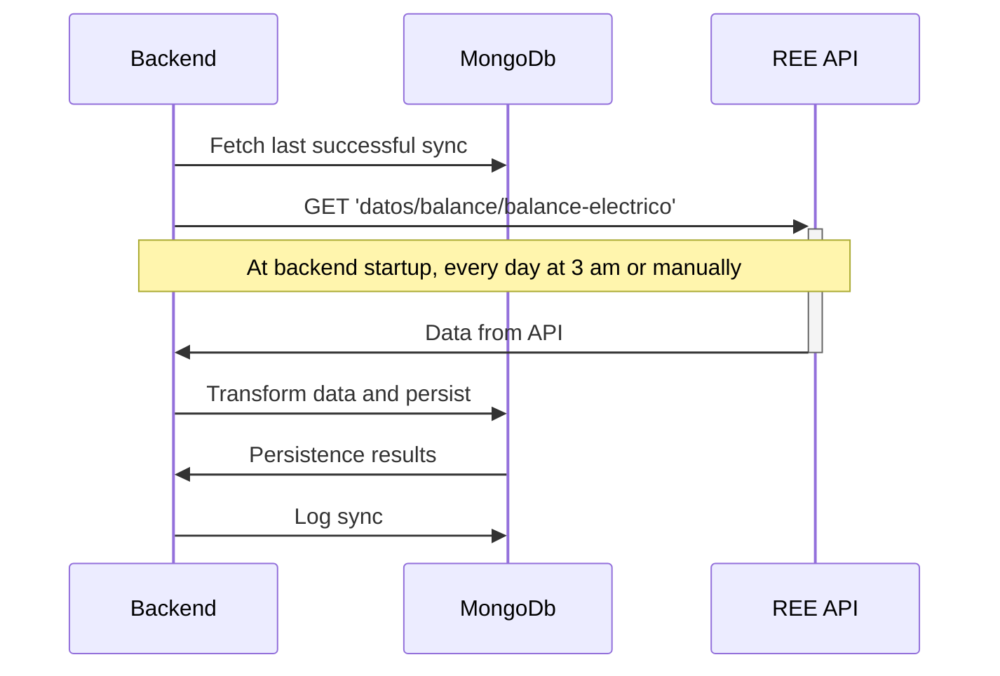
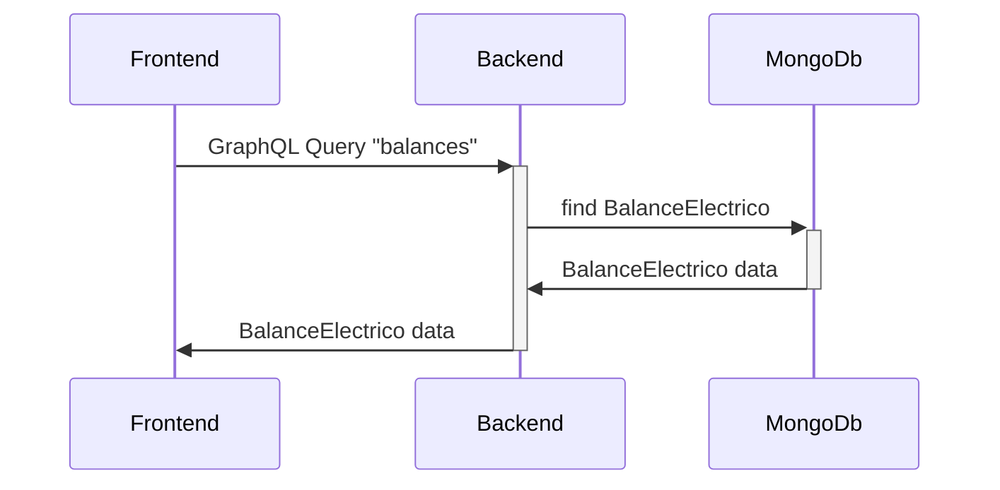
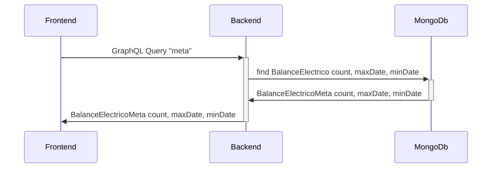
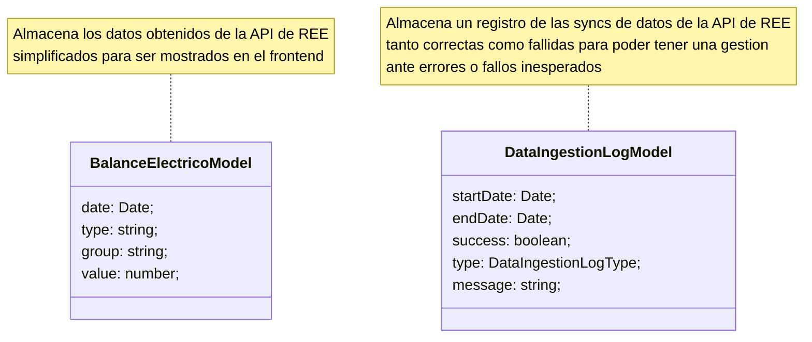
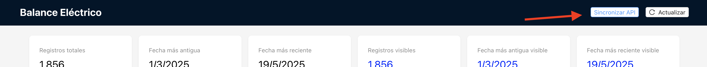
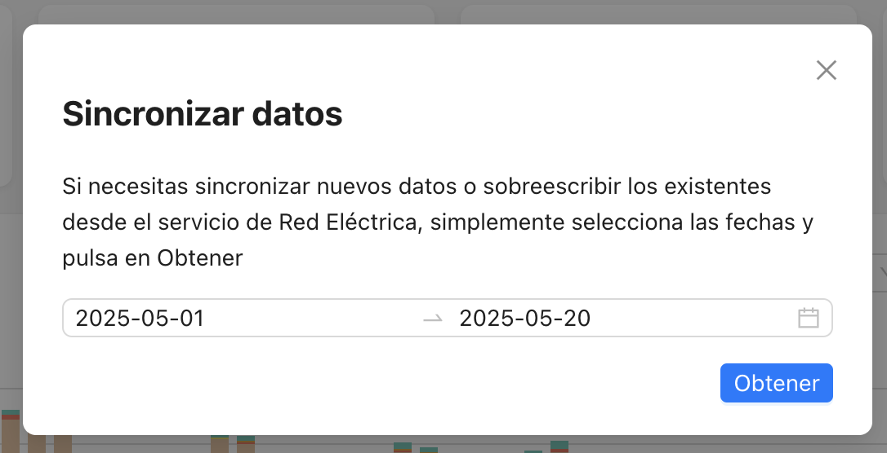

# Prueba técnica FullStack


> [!IMPORTANT]
> Es posible que al iniciar la aplicacion aparezca un mensaje de error al obtener los datos, es debido a que se está iniciando el backend. Se soluciona en unos segundos y pulsando `Reintentar` en la notificacion o actualizando.

## Iniciar aplicacion en modo PROD

Se puede usar directamente el archivo `docker-compose.prod.yml` que esta listo para funcionar. (Es recomendable cambiar las credenciales de acceso a MongoDB)

Hay que tener en cuenta que si se usa `docker-compose.prod.yml` ya se incluye una instancia de MongoDB, si se desea usar una distinta es suficiente con modificar los parametros de conexión.

Si por algun caso se necesita desplegar por separado, en los directorios `backend` y `frontend` hay un archivo `dockerfile` que se puede usar para entorno de produccion. Pero es necesario que se establezcan las variables de entorno y argumentos de la build definidas en el `docker-compose.prod.yml`. Además se requiere una instancia de MongoDB independiente.

## Iniciar aplicacion en modo DEV

Para desarrollo, la opción recomendada es usar `docker-compose up` sobre el archivo `docker-compose.dev.yml` de la raiz del proyecto.

Esto incluye hot reload y permite trabajar en el mismo entorno que en producción.

## Ejecutar tests del backend

- Navegar al directorio backend
- Desde el terminal ejecutar el comando `npm run test`

# Pipelines de datos

## Obtencion de datos desde API de REE (periódico)



## Obtencion de datos para visualizar en frontend



## Obtencion de datos para visualizar total de registros, fecha max y fecha min total



## Modelo de datos



## Obtención de datos

Actualmente el sistema obtiene datos desde la API de REE de forma automática en dos momentos

- En el inicio del sistema se obtienen los datos del mes en curso en caso de que no se haya hecho ninguna sync anterior.
- Cada dia a las 3 am se ejecuta una sync que obtiene datos desde la última sync correcta hasta el fin del dia anterior.

También se pueden obtener datos de forma manual desde el frontend, para ello se debe pulsar en el botón `Sincronizar API` de la parte superior



Y en el formulario que aparece, se escoge un rango de fechas y se pulsa en el botón de `Obtener`



Esto sincronizará el sistema, obteniendo datos desde la API de REE, con las fechas escogidas y reemplazando los datos de la BBDD con los nuevos obtenidos.

## Consultas GraphQL

### Balance Electrico

Se pueden hacer consultas en `[backend-url]/graphql`

Query sin filtros

```gql
{
  balances {
    group
    type
    date
    value
  }
}
```

Respuesta

```json
{
  "data": {
    "balances": [
      {
        "group": "No-Renovable",
        "type": "Carbón",
        "date": "2025-02-28T23:00:00.000Z",
        "value": 7107.447
      },
      {
        "group": "Almacenamiento",
        "type": "Carga batería",
        "date": "2025-02-28T23:00:00.000Z",
        "value": -1.291
      }
    ]
  }
}
```

> Se puede filtrar por `group`, `type` o `date`

Query con filtros

```gql
{
  balances(group: "No-Renovable") {
    group
    type
    date
    value
  }
}
```

Respuesta

```json
{
  "data": {
    "balances": [
      {
        "group": "No-Renovable",
        "type": "Carbón",
        "date": "2025-02-28T23:00:00.000Z",
        "value": 7107.447
      },
      {
        "group": "No-Renovable",
        "type": "Ciclo combinado",
        "date": "2025-02-28T23:00:00.000Z",
        "value": 52996.583
      }
    ]
  }
}
```

### Balance Electrico Meta

> Obtiene el count total de registros del balance eléctrico, así como la fecha máxima y mínima.

Query

```gql
{
  meta {
    count
    maxDate
    minDate
  }
}
```

Respuesta

```json
{
  "data": {
    "meta": [
      {
        "count": 1877,
        "maxDate": "2025-05-19T22:00:00.000Z",
        "minDate": "2025-02-28T23:00:00.000Z"
      }
    ]
  }
}
```
